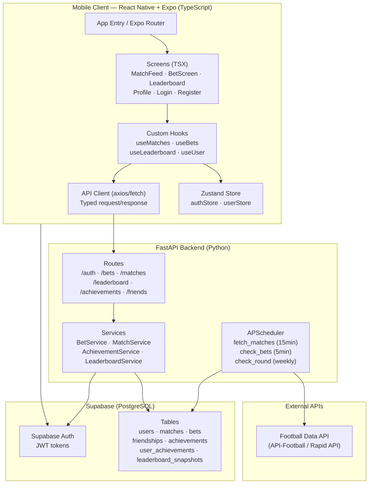

# PRD — Matchday

## 1. Overview

### Product Summary

Matchday is a free, social sports prediction game for mobile (iOS and Android). Users predict the outcomes of real football fixtures using virtual coins, earn achievements for milestones, climb a global leaderboard ranked by win rate, and follow friends to compare picks. No real money is ever involved.

The existing codebase (The Kinetic Analyst) provides a working FastAPI backend, Supabase database, and React Native/Expo frontend. This PRD specifies the transformation of that working app into Matchday: a TypeScript-first, fully tested, CI/CD-equipped production-quality codebase with game mechanics layered on top of the existing prediction core.

### Objective

This PRD covers the MVP as defined in product-vision.md — specifically: (1) full TypeScript migration of the frontend, (2) the four new feature areas (Leaderboard, Achievements, Friends, Matchday rebrand), (3) state management with Zustand, (4) custom hooks extracting all data-fetching logic, (5) unit and integration tests for both frontend and backend, and (6) a GitHub Actions CI/CD pipeline. The backend FastAPI foundation is preserved; new backend endpoints are added for the game mechanics.

### Market Differentiation

Matchday occupies a real gap: a skill-based, zero-stakes prediction game tied to live football fixtures. Sportsbooks require real money and are regulated out of casual use. Fantasy football demands weekly management overhead. WhatsApp prediction threads offer no structure, history, or leaderboard. Matchday is what that group chat prediction thread would be if it tracked your record, gave you a rank, and let you prove over a full season that you read the game better than your friends. The technical implementation must deliver: automatic result resolution (so the app feels live and responsive), a fast match feed (so the core action is frictionless), and a visible progression system (so users have a reason to return).

### Magic Moment

The magic moment: a new user places their first prediction, the match resolves over the weekend, the app credits their balance, and a "First Correct Call" badge appears. To make this reliable and impactful: result resolution must trigger within 10 minutes of a match ending (the scheduler runs every 5 minutes), the balance update must be visible immediately when the user opens the app, and the badge display must be prominent on the profile screen. The path from sign-up to magic moment is three screens (Login → Match Feed → Bet Screen) with no friction between them.

### Success Criteria

- Full TypeScript coverage: zero `any` types in component and hook files; strict mode enabled
- GitHub Actions CI passes on every PR: type-check, lint, unit tests, pytest
- Pytest coverage ≥ 80% on BetService and MatchService
- React Native Testing Library tests covering BetScreen, MatchCard, and LeaderboardScreen
- Match result resolution within 10 minutes of fixture end in production
- First prediction placeable in under 60 seconds from account creation
- Leaderboard screen loads in under 2 seconds (on first load; cached thereafter)
- README documents setup, architecture decisions, and test strategy

---

## 2. Technical Architecture

### Architecture Overview



### Chosen Stack

| Layer | Choice | Rationale |
|---|---|---|
| Frontend | React Native + Expo (TypeScript) | Existing foundation. Migration from JSX to TSX closes the TypeScript portfolio gap. Expo simplifies builds and OTA updates. |
| Backend | FastAPI (Python) | Already implemented with route/service/model separation, Pydantic models, JWT auth middleware, and APScheduler. Pytest adds test coverage. |
| Database | Supabase (PostgreSQL) | Already in use. New tables for friendships, achievements, user_achievements. RLS policies documented as full-stack skill signal. |
| Auth | Supabase Auth | Already integrated. JWT tokens passed via Authorization header to FastAPI middleware. Email/password + magic link. |
| Payments | None | Virtual coins only. Balance managed in the users table. |

### Stack Integration Guide

**Setup order:**
1. Supabase project created and environment variables configured (see § Environment Variables below)
2. FastAPI backend runs locally (`uvicorn app.main:app --reload`)
3. Expo project runs with `npx expo start`
4. Frontend calls the FastAPI backend URL (via `EXPO_PUBLIC_API_URL` env var — not Supabase directly for most operations, except auth)

**Auth flow integration:**
- Supabase Auth issues JWT tokens on login
- Frontend stores the JWT in Zustand `authStore` (and SecureStore for persistence)
- Every FastAPI request includes `Authorization: Bearer <token>` header
- `app/middleware/auth_dependency.py` → `get_current_user` verifies the JWT against Supabase's JWKS endpoint
- Supabase RLS is a secondary layer — backend service calls use the service_role key, so RLS applies to direct Supabase client calls from mobile (none in the current architecture — all data flows through FastAPI)

**Known gotchas:**
- Expo Router uses file-based routing under `app/`. Screen files should be in `app/screens/` and exported as default. Navigation params must be typed using Expo Router's typed routes feature — enable `typedRoutes: true` in `app.json`
- NativeWind v4 requires the `withNativeWind` Babel plugin wrapper in `babel.config.js`. Tailwind classes are processed at build time — custom tokens in `tailwind.config.js` must match the design token names exactly
- Supabase client in the frontend (`supabase/supabase.ts`) is used ONLY for auth (signIn, signOut, session management). All data operations go through the FastAPI backend
- APScheduler's `BackgroundScheduler` is synchronous — async service methods called from jobs must use `asyncio.run()`. This is already implemented in `app/jobs/scheduler.py`

**Required environment variables:**

```
# Frontend (.env)
EXPO_PUBLIC_API_URL=http://localhost:8000        # FastAPI backend URL
EXPO_PUBLIC_SUPABASE_URL=https://xxx.supabase.co
EXPO_PUBLIC_SUPABASE_ANON_KEY=eyJ...

# Backend (.env)
SUPABASE_URL=https://xxx.supabase.co
SUPABASE_KEY=eyJ...                              # service_role key
FOOTBALL_API_KEY=xxx                             # API-Football key
```

### Repository Structure

Two repositories are maintained. The intended structure after the Matchday migration:

**sports-bets-api (backend)**
```
sports-bets-api/
├── app/
│   ├── db/
│   │   └── supabase_client.py       # Supabase service client
│   ├── jobs/
│   │   └── scheduler.py             # APScheduler cron jobs
│   ├── middleware/
│   │   └── auth_dependency.py       # JWT validation
│   ├── models/                      # Pydantic request/response models
│   │   ├── bet.py
│   │   ├── match.py
│   │   ├── user.py
│   │   ├── achievement.py           # NEW
│   │   ├── leaderboard.py           # NEW
│   │   └── friendship.py            # NEW
│   ├── routes/                      # FastAPI routers
│   │   ├── auth.py
│   │   ├── bets.py
│   │   ├── matches.py
│   │   ├── user.py
│   │   ├── leaderboard.py           # NEW
│   │   ├── achievements.py          # NEW
│   │   └── friends.py               # NEW
│   ├── services/                    # Business logic
│   │   ├── auth_service.py
│   │   ├── bet_service.py
│   │   ├── match_service.py
│   │   ├── user_service.py
│   │   ├── achievement_service.py   # NEW
│   │   ├── leaderboard_service.py   # NEW
│   │   └── friendship_service.py    # NEW
│   └── main.py
├── tests/                           # NEW — pytest test suite
│   ├── conftest.py
│   ├── test_bet_service.py
│   ├── test_match_service.py
│   ├── test_achievement_service.py
│   └── test_routes/
│       ├── test_bets.py
│       └── test_matches.py
├── docs/
│   ├── product-vision.md
│   ├── prd.md
│   └── product-roadmap.md
├── vision.json
├── requirements.txt
├── .env
├── .github/
│   └── workflows/
│       └── ci.yml                   # NEW — GitHub Actions
└── README.md                        # NEW
```

**sports-bets-frontend (frontend)**
```
sports-bets-frontend/
├── app/
│   ├── index.tsx                    # Entry (was .jsx)
│   ├── screens/
│   │   ├── LoginScreen.tsx          # Migrated from .jsx
│   │   ├── RegisterScreen.tsx
│   │   ├── MatchesScreen.tsx
│   │   ├── BetScreen.tsx
│   │   ├── UserScreen.tsx
│   │   ├── LeaderboardScreen.tsx    # NEW
│   │   └── FriendProfileScreen.tsx  # NEW
├── components/
│   ├── MatchCard.tsx                # Extracted from MatchesScreen
│   ├── BetCard.tsx                  # Extracted from UserScreen
│   ├── LeaderboardRow.tsx           # NEW
│   ├── AchievementBadge.tsx         # NEW
│   └── ui/
│       ├── Button.tsx               # Design system primitive
│       ├── Chip.tsx
│       └── StatRow.tsx
├── hooks/                           # NEW — custom hooks
│   ├── useMatches.ts
│   ├── useBets.ts
│   ├── useUser.ts
│   ├── useLeaderboard.ts
│   ├── useAchievements.ts
│   └── useFriends.ts
├── store/                           # NEW — Zustand stores
│   ├── authStore.ts
│   └── userStore.ts
├── lib/                             # NEW
│   ├── api.ts                       # Typed API client
│   ├── schemas.ts                   # Zod schemas for API responses
│   └── constants.ts
├── supabase/
│   ├── supabase.ts                  # Auth client only
│   └── api.ts                       # DEPRECATED — replaced by lib/api.ts
├── types/                           # NEW
│   └── index.ts                     # Shared TypeScript type definitions
├── __tests__/                       # NEW — Jest + RNTL
│   ├── components/
│   │   ├── MatchCard.test.tsx
│   │   └── BetScreen.test.tsx
│   └── hooks/
│       └── useMatches.test.ts
├── tailwind.config.js
├── tsconfig.json                    # Update to strict mode
├── app.json
├── .github/
│   └── workflows/
│       └── ci.yml                   # NEW
└── README.md                        # NEW
```

### Infrastructure & Deployment

**Backend:** Deploy FastAPI on Railway, Render, or Fly.io (all support Python, Docker, free tiers). Recommended: Railway for simplicity. Connect to the production Supabase project via environment variables. The APScheduler runs in-process — no separate worker infrastructure needed for MVP.

**Frontend:** Expo Go for development. For production distribution: Expo Application Services (EAS) for building and submitting to App Store / Play Store. For the portfolio, an EAS-generated `.apk` (Android) plus an Expo Go shareable link is sufficient.

**CI/CD:** GitHub Actions (see § GitHub Actions in the roadmap). Two workflows: one for the backend (pytest, type-checking via mypy), one for the frontend (TypeScript type-check, ESLint, Jest).

### Security Considerations

- JWT verification happens in `auth_dependency.py` for every protected route. Tokens are short-lived (Supabase default: 1 hour) and refreshed automatically by the Supabase client
- All user-facing data operations in the backend filter by `user_id` extracted from the verified JWT — no user can access another user's bets or balance except via the public leaderboard and friend profile endpoints
- Virtual balance manipulation is server-side only — the client never sends a new balance value, only bet amounts, which the service validates before deducting
- Input validation: Pydantic models on all POST request bodies. `bet.amount` is validated as `Field(gt=0)`. Prediction outcome is validated as an enum
- No sensitive data in the frontend bundle: API keys are server-side only. Supabase anon key is safe to expose (it's public by design)
- Rate limiting: FastAPI `slowapi` middleware should be added on the `/auth` routes for production (brute force protection on login/register)

### Cost Estimate

| Service | Free Tier | Expected Usage | Monthly Cost |
|---|---|---|---|
| Supabase | 500MB DB, 2GB bandwidth, 50,000 MAU | < 100 users | $0 |
| Railway (backend) | $5 credit/month | FastAPI + scheduler | ~$0–5 |
| API-Football | 100 calls/day free | ~30–50 calls/day | $0 |
| Expo EAS | Free for development builds | Portfolio builds | $0 |
| GitHub Actions | 2,000 min/month free | ~20 min/push | $0 |
| **Total** | | | **$0–5/month** |

---

## 3. Data Model

### Entity Definitions

All tables live in Supabase (PostgreSQL). Existing tables are marked; new tables are marked NEW.

```sql
-- EXISTING: users table
CREATE TABLE users (
  id UUID PRIMARY KEY REFERENCES auth.users(id),
  username VARCHAR(50) UNIQUE NOT NULL,
  balance DECIMAL(10, 2) NOT NULL DEFAULT 1000.00,
  created_at TIMESTAMPTZ DEFAULT NOW()
);

-- EXISTING: matches table
CREATE TABLE matches (
  fixture_id INTEGER PRIMARY KEY,
  fixture_date TIMESTAMPTZ NOT NULL,
  fixture_status VARCHAR(50) NOT NULL,
  league_id INTEGER NOT NULL,
  league_name VARCHAR(100) NOT NULL,
  league_round VARCHAR(50),
  teamhome_name VARCHAR(100) NOT NULL,
  teamhome_logo TEXT,
  teamhome_winner BOOLEAN,
  teamaway_name VARCHAR(100) NOT NULL,
  teamaway_logo TEXT,
  teamaway_winner BOOLEAN,
  goal_home INTEGER,
  goal_away INTEGER,
  odd_home DECIMAL(5, 2),
  odd_draw DECIMAL(5, 2),
  odd_away DECIMAL(5, 2)
);

-- EXISTING: bets table
CREATE TABLE bets (
  id UUID PRIMARY KEY DEFAULT gen_random_uuid(),
  user_id UUID NOT NULL REFERENCES users(id) ON DELETE CASCADE,
  match_id INTEGER NOT NULL REFERENCES matches(fixture_id),
  amount DECIMAL(10, 2) NOT NULL CHECK (amount > 0),
  odds DECIMAL(5, 2) NOT NULL,
  prediction VARCHAR(10) NOT NULL CHECK (prediction IN ('home', 'away', 'draw')),
  status VARCHAR(10) NOT NULL DEFAULT 'open' CHECK (status IN ('open', 'won', 'lost')),
  created_at TIMESTAMPTZ DEFAULT NOW()
);

-- NEW: achievements definition table (static catalog)
CREATE TABLE achievements (
  id VARCHAR(50) PRIMARY KEY,           -- e.g. 'first_correct_call'
  name VARCHAR(100) NOT NULL,           -- e.g. 'First Correct Call'
  description TEXT NOT NULL,
  icon VARCHAR(50) NOT NULL,            -- Lucide icon name
  color VARCHAR(7) NOT NULL             -- hex color for glow
);

-- NEW: user_achievements (earned badges)
CREATE TABLE user_achievements (
  id UUID PRIMARY KEY DEFAULT gen_random_uuid(),
  user_id UUID NOT NULL REFERENCES users(id) ON DELETE CASCADE,
  achievement_id VARCHAR(50) NOT NULL REFERENCES achievements(id),
  earned_at TIMESTAMPTZ DEFAULT NOW(),
  UNIQUE(user_id, achievement_id)
);

-- NEW: friendships (follow system — unidirectional)
CREATE TABLE friendships (
  id UUID PRIMARY KEY DEFAULT gen_random_uuid(),
  follower_id UUID NOT NULL REFERENCES users(id) ON DELETE CASCADE,
  following_id UUID NOT NULL REFERENCES users(id) ON DELETE CASCADE,
  created_at TIMESTAMPTZ DEFAULT NOW(),
  UNIQUE(follower_id, following_id),
  CHECK (follower_id != following_id)
);

-- NEW: leaderboard_snapshots (cached rankings — updated by scheduler)
CREATE TABLE leaderboard_snapshots (
  id UUID PRIMARY KEY DEFAULT gen_random_uuid(),
  user_id UUID NOT NULL REFERENCES users(id) ON DELETE CASCADE,
  rank INTEGER NOT NULL,
  win_rate DECIMAL(5, 2) NOT NULL,
  total_predictions INTEGER NOT NULL,
  total_wins INTEGER NOT NULL,
  current_streak INTEGER NOT NULL DEFAULT 0,
  snapshot_at TIMESTAMPTZ DEFAULT NOW()
);
```

**Achievement seed data:**
```sql
INSERT INTO achievements (id, name, description, icon, color) VALUES
  ('first_correct_call', 'First Correct Call', 'Correctly predict your first match outcome', 'Target', '#00f0ff'),
  ('winning_streak_5', 'On Fire', 'Correctly predict 5 matches in a row', 'Zap', '#9b59ff'),
  ('sharp_analyst', 'Sharp Analyst', 'Reach 60% win rate with at least 10 predictions', 'TrendingUp', '#00f0ff'),
  ('early_bird', 'Early Bird', 'Predict all fixtures in a round before any match starts', 'Clock', '#d4b4ff'),
  ('upset_special', 'Upset Special', 'Correctly predict an underdog win (odds > 3.0)', 'AlertTriangle', '#ffd700');
```

### Relationships

- `users` ← 1:many → `bets` (one user has many bets; bet deleted if user deleted)
- `users` ← 1:many → `user_achievements` (one user has many earned achievements)
- `achievements` ← 1:many → `user_achievements` (one achievement can be earned by many users)
- `matches` ← 1:many → `bets` (one match can have many bets; match is the source of truth for resolution)
- `users` ← many:many → `users` via `friendships` (follower follows following; unidirectional)
- `users` ← 1:1 → `leaderboard_snapshots` (latest snapshot per user; older snapshots are overwritten or kept for history)

### Indexes

```sql
-- Bets lookups by user and status (most frequent query in check_bets scheduler)
CREATE INDEX idx_bets_user_id ON bets(user_id);
CREATE INDEX idx_bets_status ON bets(status) WHERE status = 'open';
CREATE INDEX idx_bets_match_id ON bets(match_id);

-- Matches lookups by status (scheduler and feed queries)
CREATE INDEX idx_matches_fixture_status ON matches(fixture_status);
CREATE INDEX idx_matches_fixture_date ON matches(fixture_date);

-- Leaderboard (sorted by win rate, filtered by minimum predictions)
CREATE INDEX idx_leaderboard_win_rate ON leaderboard_snapshots(win_rate DESC)
  WHERE total_predictions >= 5;

-- Friendships (lookup "who does this user follow" and "who follows this user")
CREATE INDEX idx_friendships_follower ON friendships(follower_id);
CREATE INDEX idx_friendships_following ON friendships(following_id);

-- User achievements (check if achievement already earned)
CREATE INDEX idx_user_achievements_user ON user_achievements(user_id);
```

---

## 4. API Specification

### API Design Philosophy

REST API with JSON request/response bodies. Authentication via `Authorization: Bearer <jwt>` header on all protected routes. Errors return consistent shape: `{ "detail": string }` (FastAPI default). All list endpoints return arrays directly (no pagination wrapper for MVP — add cursor pagination if row counts exceed 1000). Validated input via Pydantic models on all POST bodies.

### Endpoints

**Auth routes** (existing)

```
POST /auth/login
Auth: None
Body: { email: string, password: string }
Response 200: { access_token: string, token_type: "bearer", user: { id: string, username: string, balance: number } }
Response 401: { detail: "Invalid credentials" }

POST /auth/register
Auth: None
Body: { email: string, password: string, username: string }
Response 201: { access_token: string, token_type: "bearer", user: { id: string, username: string, balance: number } }
Response 400: { detail: "Username already taken" | "Email already registered" }

POST /auth/magic-link
Auth: None
Body: { email: string }
Response 200: { message: "Magic link sent" }
```

**Matches routes** (existing)

```
GET /matches/
Auth: None
Response 200: Match[]

GET /matches/rounds
Auth: None
Response 200: { current: [{ round: number, matches: Match[] }] }
```

**Bets routes** (existing)

```
GET /bets/
Auth: Required
Response 200: BetWithMatch[]     # includes nested matches data

POST /bets/
Auth: Required
Body: { match_id: string, amount: number, odds: number, prediction: "home" | "away" | "draw" }
Response 200: { message: "Bet placed successfully" }
Response 400: { detail: "Not enough balance" | "Match has already started" }

DELETE /bets/
Auth: Required
Query: bet_id=string&match_id=string
Response 200: { message: "Bet deleted successfully" }
Response 400: { detail: "Game has already started or finished" }
```

**User routes** (existing + additions)

```
GET /user/profile
Auth: Required
Response 200: {
  id: string,
  username: string,
  balance: number,
  stats: {
    total_predictions: number,
    total_wins: number,
    win_rate: number,
    current_streak: number,
    longest_streak: number
  }
}

GET /user/achievements
Auth: Required
Response 200: UserAchievement[]   # earned achievements with earned_at timestamps
```

**Leaderboard routes** (NEW)

```
GET /leaderboard/
Auth: None
Query: limit=50&offset=0
Response 200: {
  entries: [
    {
      rank: number,
      user_id: string,
      username: string,
      win_rate: number,
      total_predictions: number,
      total_wins: number,
      current_streak: number
    }
  ],
  total: number,
  updated_at: string
}

GET /leaderboard/me
Auth: Required
Response 200: { rank: number, ...leaderboard entry }
Response 404: { detail: "Not ranked yet — make 5 predictions to qualify" }
```

**Achievements routes** (NEW)

```
GET /achievements/
Auth: None
Response 200: Achievement[]       # full catalog

GET /achievements/me
Auth: Required
Response 200: UserAchievement[]   # earned achievements for current user
```

**Friends routes** (NEW)

```
GET /friends/following
Auth: Required
Response 200: [{ user_id: string, username: string, win_rate: number, current_streak: number }]

POST /friends/follow
Auth: Required
Body: { user_id: string }
Response 200: { message: "Now following user" }
Response 404: { detail: "User not found" }
Response 400: { detail: "Already following" }

DELETE /friends/unfollow
Auth: Required
Query: user_id=string
Response 200: { message: "Unfollowed" }

GET /friends/profile/{user_id}
Auth: Required
Response 200: {
  user_id: string,
  username: string,
  stats: { ... },
  recent_bets: BetWithMatch[],   # last 10 resolved predictions
  achievements: UserAchievement[]
}
```

**Pydantic type definitions** (add to `app/models/`):

```python
# app/models/leaderboard.py
from pydantic import BaseModel
from datetime import datetime

class LeaderboardEntry(BaseModel):
    rank: int
    user_id: str
    username: str
    win_rate: float
    total_predictions: int
    total_wins: int
    current_streak: int

class LeaderboardResponse(BaseModel):
    entries: list[LeaderboardEntry]
    total: int
    updated_at: datetime

# app/models/achievement.py
class Achievement(BaseModel):
    id: str
    name: str
    description: str
    icon: str
    color: str

class UserAchievement(BaseModel):
    achievement: Achievement
    earned_at: datetime

# app/models/friendship.py
class FriendProfile(BaseModel):
    user_id: str
    username: str
    win_rate: float
    current_streak: int
```

---

## 5. User Stories

### Epic: Predictions (Core Loop)

**US-001: Place a prediction**
As Luca, I want to select a match outcome and coin amount so that I can compete on accuracy when the result resolves.

Acceptance Criteria:
- [ ] Given I'm on the Match Feed, when I tap a match card, then BetScreen opens with that match's data pre-loaded
- [ ] Given I'm on BetScreen, when I tap HOME, DRAW, or AWAY, then that outcome is selected and the Probability Flux updates
- [ ] Given I have entered a valid amount, when I tap CONFIRM, then the bet is placed and my balance decreases immediately
- [ ] Given my balance is less than the entered amount, when I tap CONFIRM, then the button is disabled and "INSUFFICIENT BALANCE" is shown
- [ ] Edge case: Match starts before resolution — prediction placement is blocked with "MATCH IN PROGRESS"

**US-002: See my prediction history**
As Luca, I want to see all my past predictions with their outcomes so that I can track my accuracy over time.

Acceptance Criteria:
- [ ] Given I'm on my Profile screen, when it loads, then I see all bets sorted by most recent first
- [ ] Given a bet has resolved, then its card shows WON (cyan), LOST (red), or the status chip uses purple for PENDING
- [ ] Given I have no bets, then the empty state reads "NO PREDICTIONS YET. Your record starts with your first call."

### Epic: Progression

**US-003: Earn a badge**
As Luca, I want to receive achievement badges for milestones so that my skill and commitment are visible on my profile.

Acceptance Criteria:
- [ ] Given I correctly predict my first match, then the "First Correct Call" badge is added to my profile automatically
- [ ] Given I correctly predict 5 consecutive matches, then "On Fire" badge appears
- [ ] Given I open my profile, then earned badges are displayed prominently with their icons and glow treatments
- [ ] Edge case: If a badge criterion is met by a scheduler run, the badge appears next time the user opens the app (no push notification required for MVP)

**US-004: Check the leaderboard**
As Luca, I want to see how my win rate compares to all other users so that I know my standing in the community.

Acceptance Criteria:
- [ ] Given I have made 5+ predictions, then I appear on the global leaderboard ranked by win rate
- [ ] Given I'm on the Leaderboard screen, then my own rank is highlighted
- [ ] Given I have fewer than 5 predictions, then my leaderboard row shows "Make 5 predictions to qualify"
- [ ] Given the leaderboard loads, then it shows rank, username, win rate, and streak for each entry

### Epic: Social

**US-005: Follow a friend**
As Luca, I want to follow other users so that I can see their prediction records and compare performance.

Acceptance Criteria:
- [ ] Given I'm viewing a user's profile (from leaderboard or search), then I can tap FOLLOW
- [ ] Given I follow a user, then their recent resolved predictions are visible on their profile
- [ ] Given I'm on my own profile, then a FOLLOWING tab shows users I follow with a quick summary

**US-006: View a friend's predictions**
As Luca, I want to see what my friends predicted on the same matches so that I can compare our calls.

Acceptance Criteria:
- [ ] Given I follow a user, when I view their profile, then I can see their last 10 resolved predictions
- [ ] Given a match is upcoming, friend predictions are hidden (reveal after match starts to prevent copying)

### Epic: TypeScript & Quality

**US-007: Type-safe navigation**
As a developer reviewing the portfolio, I want all navigation parameters to be typed so that the codebase demonstrates TypeScript best practices.

Acceptance Criteria:
- [ ] All screen navigation params are defined in `types/index.ts`
- [ ] Expo Router typed routes feature enabled in `app.json`
- [ ] No `useLocalSearchParams` without typed parameter destructuring

---

## 6. Functional Requirements

**FR-001: Match Feed**
Priority: P0
Description: Display current Bundesliga round's fixtures grouped by round. Each fixture shows home/away teams, current score (or VS), odds for all three outcomes, match status (UPCOMING / LIVE / FINAL), and match date. Data is fetched from the FastAPI backend which syncs from the football API every 15 minutes via scheduler.
Acceptance Criteria:
- Fixtures render in a SectionList grouped by round label
- LIVE matches show a pulsing cyan dot indicator
- Tapping a match navigates to BetScreen with the full match object passed as a typed navigation param
- Empty state: "NO ACTIVE MARKETS. Data stream is quiet."
- Loading state: ActivityIndicator with primary-glow color + "LOADING DATA STREAM"
Related Stories: US-001

**FR-002: Prediction Placement**
Priority: P0
Description: Users select HOME/DRAW/AWAY, enter a coin amount, and confirm. Server validates balance sufficiency and match status (must be "Not Started"). Balance is deducted atomically server-side.
Acceptance Criteria:
- Amount input is numeric-only with a $ prefix replaced by a coin icon
- Probability Flux bar updates as outcome is selected (implied probability = 1 / odds × 100)
- Potential return = amount × odds is shown in real time
- CTA is disabled until both outcome and valid amount are set
- Success: navigate back to Match Feed with success toast
- Error: inline error message below CTA, no navigation
Related Stories: US-001

**FR-003: Result Resolution**
Priority: P0
Description: The `check_bets_job` scheduler runs every 5 minutes and calls `BetService.check_bets()`. For each open bet where the match is "Match Finished", the prediction is evaluated, balance credited on win, bet status updated to "won" or "lost". Achievement checks run immediately after bet resolution.
Acceptance Criteria:
- All open bets for finished matches resolve within 10 minutes of match end
- Balance update is atomic — no partial state where bet is marked won but balance not credited
- Achievement service is called synchronously within the same scheduler job after resolution
Related Stories: US-002, US-003

**FR-004: User Profile with Stats**
Priority: P0
Description: Profile screen shows username, balance, win rate, total predictions, current streak, and earned achievement badges. Stats are computed by the backend from the bets table — not cached.
Acceptance Criteria:
- Win rate = total_wins / total_predictions (0 if no predictions)
- Current streak = consecutive wins counting back from most recent resolved bet
- Badges displayed as a horizontal scroll of AchievementBadge components
- "No badges yet" state when user has zero achievements
Related Stories: US-002, US-003

**FR-005: Global Leaderboard**
Priority: P0
Description: Ranked list of all users with ≥ 5 predictions, sorted by win rate descending. Leaderboard data is computed by LeaderboardService and cached in leaderboard_snapshots, refreshed by a new scheduler job every hour.
Acceptance Criteria:
- Minimum 5 predictions to appear on leaderboard
- Sorted by win_rate DESC, tie-broken by total_predictions DESC
- Current user's row is visually highlighted with a subtle cyan left border
- Leaderboard loads from cached snapshot — max age 1 hour
Related Stories: US-004

**FR-006: Achievement System**
Priority: P0
Description: Five achievements are awarded automatically by AchievementService called during bet resolution. Each achievement can only be earned once per user.
Acceptance Criteria:
- `first_correct_call`: awarded when a user's first prediction resolves as "won"
- `winning_streak_5`: awarded when user has 5+ consecutive "won" bets
- `sharp_analyst`: awarded when win_rate ≥ 60% AND total_predictions ≥ 10
- `early_bird`: awarded when user has predictions on all fixtures in a round before the first match of that round starts (implement in round-check scheduler job)
- `upset_special`: awarded when user correctly predicts a win where the winner's odds were > 3.0
- Awards are idempotent — no error or duplicate if achievement already exists (use INSERT OR IGNORE or upsert)
Related Stories: US-003

**FR-007: TypeScript Migration**
Priority: P0
Description: Migrate all frontend `.jsx` files to `.tsx`. Enable strict mode in `tsconfig.json`. Define shared types in `types/index.ts`. All API response shapes are typed via Zod schemas in `lib/schemas.ts`.
Acceptance Criteria:
- `tsconfig.json` has `"strict": true`
- No `any` types in component or hook files (`// @ts-expect-error` allowed with TODO comment for genuine edge cases)
- All API response objects match their Zod schema definitions
- `lib/api.ts` exports typed fetch functions for all endpoints
Related Stories: US-007

**FR-008: Custom Hooks**
Priority: P0
Description: Extract all data-fetching and side-effect logic from screens into custom hooks in `hooks/`. Each hook manages its own loading/error state and returns typed data.
Acceptance Criteria:
- `useMatches()` → `{ matches: MatchRound[], loading: boolean, error: string | null, refetch: () => void }`
- `useBets()` → `{ bets: BetWithMatch[], loading: boolean, error: string | null }`
- `useUser()` → `{ user: UserProfile | null, loading: boolean, refetch: () => void }`
- `useLeaderboard()` → `{ entries: LeaderboardEntry[], loading: boolean, myRank: number | null }`
- `useAchievements()` → `{ earned: UserAchievement[], loading: boolean }`
- `useFriends()` → `{ following: FriendSummary[], follow: (userId: string) => Promise<void>, unfollow: (userId: string) => Promise<void> }`
Related Stories: All

**FR-009: Zustand Global State**
Priority: P0
Description: Replace inline auth state management with Zustand stores. `authStore` manages the JWT token and session. `userStore` manages the current user's profile data and balance.
Acceptance Criteria:
- `authStore`: `{ token: string | null, session: Session | null, setSession: (s) => void, clearSession: () => void }`
- `userStore`: `{ user: UserProfile | null, setUser: (u) => void, updateBalance: (b: number) => void }`
- Token is persisted to Expo SecureStore on set, cleared on logout
- All screens that previously used inline auth state use `useAuthStore()` / `useUserStore()` instead
Related Stories: All

**FR-010: Friends / Follow System**
Priority: P1
Description: Users can follow other users. Following is unidirectional (not mutual friendship). Followed users' profiles are accessible showing their recent resolved predictions and stats.
Acceptance Criteria:
- Follow/unfollow action available from Leaderboard row tap → FriendProfileScreen
- FriendProfileScreen shows: username, stats (win rate, streak), recent 10 resolved predictions, badges
- Following list accessible from Profile screen FOLLOWING tab
- Friend predictions for upcoming matches are hidden until the match starts (prevent copying)
Related Stories: US-005, US-006

**FR-011: Unit Tests — Backend**
Priority: P0
Description: pytest suite covering all service methods. Tests use mock Supabase clients to avoid hitting the real database.
Acceptance Criteria:
- `test_bet_service.py` covers: place_bet (success, insufficient balance, match started), delete_bet (success, match started), check_bets (won, lost, unresolved)
- `test_match_service.py` covers: get_matches, get_matches_by_rounds
- `test_achievement_service.py` covers: each of the 5 achievement trigger conditions
- All tests use `pytest-mock` fixtures — no real Supabase calls
- `pytest --co` reports ≥ 15 test cases collected
Related Stories: Portfolio requirement

**FR-012: Unit + Component Tests — Frontend**
Priority: P0
Description: Jest + React Native Testing Library tests for core components and hooks.
Acceptance Criteria:
- `MatchCard.test.tsx`: renders LIVE status correctly, renders score when goals present, renders VS when unplayed
- `BetScreen.test.tsx`: CTA disabled until outcome + amount set, correct probability displayed, balance error shown for insufficient balance
- `useMatches.test.ts`: hook returns loading state on mount, returns match data on resolve, handles error state
- Tests pass with `npx jest --coverage`; coverage report shows ≥ 70% for tested files
Related Stories: Portfolio requirement

**FR-013: GitHub Actions CI**
Priority: P0
Description: Two CI workflows — one per repository. Both run on every push to main and on every pull request.
Acceptance Criteria:

Backend CI (`sports-bets-api/.github/workflows/ci.yml`):
- Install Python dependencies from requirements.txt
- Run `mypy app/` for type checking
- Run `pytest tests/ -v`
- Fail the workflow if any step exits non-zero

Frontend CI (`sports-bets-frontend/.github/workflows/ci.yml`):
- Install Node dependencies
- Run `tsc --noEmit` for type checking
- Run `npx eslint .`
- Run `npx jest --ci`
- Fail the workflow if any step exits non-zero
Related Stories: Portfolio requirement

---

## 7. Non-Functional Requirements

### Performance

- Match feed initial load < 2 seconds on WiFi (cached data from Supabase, not live football API per request)
- Bet placement round-trip < 1 second (FastAPI endpoint + 2 Supabase queries)
- Leaderboard load < 2 seconds (reads from leaderboard_snapshots cache, not computed on request)
- Result resolution within 10 minutes of match end (scheduler runs every 5 minutes)
- App bundle size: Expo manages this — no specific target, but avoid large image imports or unneeded dependencies
- TypeScript compilation (CI): `tsc --noEmit` must complete in under 60 seconds

### Security

- JWT tokens validated on every protected API call via `get_current_user` dependency
- JWT expiry: Supabase default 1 hour; frontend must refresh token automatically via Supabase client
- Balance operations server-side only — no client-controlled balance fields accepted
- Input validation: Pydantic rejects invalid prediction values and negative amounts at the API layer
- Rate limiting: `slowapi` on `/auth/login` and `/auth/register` — 10 requests per minute per IP
- Environment variables: no API keys in source code; all in `.env` files excluded from git

### Accessibility

- WCAG 2.1 AA color contrast for all text (verified against design token table in product-vision.md)
- All interactive elements have `accessibilityLabel` and `accessibilityRole` props
- Minimum touch target: 44×44px for all tappable elements
- `accessibilityHint` on non-obvious interactions (e.g. odds buttons: "Tap to select home win as your prediction")
- Tested manually with iOS VoiceOver on at least one screen (MatchesScreen)

### Scalability

- Target: 100–500 concurrent users (well within Supabase free tier)
- Leaderboard computed by scheduler and cached — not computed per request
- Supabase indexes on bets.user_id, bets.status, and leaderboard_snapshots.win_rate ensure sub-100ms queries at small scale
- No horizontal scaling needed for MVP — single FastAPI instance with APScheduler is sufficient

### Reliability

- Scheduler jobs wrapped in try/except — failure in check_bets does not crash the scheduler process; errors logged to stdout
- Failed football API calls (network timeout, rate limit) are caught and logged; the scheduler retries on the next interval
- Supabase service client uses the service_role key — RLS bypassed for scheduler operations, so RLS misconfiguration cannot block result resolution
- CI must pass on every PR — broken tests block merge

---

## 8. UI/UX Requirements

### Screen: Match Feed (MatchesScreen.tsx)

Route: `/screens/MatchesScreen`
Purpose: Browse upcoming, live, and finished fixtures for the current Bundesliga round. Entry point to placing a prediction.

States:
- **Loading:** Full-screen ActivityIndicator (primary-glow) + "LOADING DATA STREAM" label
- **Populated:** SectionList with round headers and MatchCard components
- **Empty:** "NO ACTIVE MARKETS. Data stream is quiet." centered in dimmed text
- **Error:** "FEED UNAVAILABLE. Check connection and try again." with a retry button

Key Interactions:
- Tap match card → navigate to BetScreen with typed `match` param
- Tap ANALYST button in navbar → navigate to UserScreen (profile)
- Pull to refresh (optional v1 enhancement) → refetch matches

Components: MatchCard, StatusChip, OddsChip, SectionHeader, Navbar

### Screen: Bet Screen (BetScreen.tsx)

Route: `/screens/BetScreen`
Params: `{ match: string }` (JSON-serialized Match object — typed on parse via Zod)
Purpose: Review match details, select prediction outcome, enter coin amount, confirm prediction.

States:
- **No selection:** CTA disabled, probability flux at 0
- **Outcome selected:** Probability Flux updates, CTA still disabled until amount entered
- **Valid amount:** CTA enabled with cyan glow
- **Insufficient balance:** CTA disabled, error label "INSUFFICIENT BALANCE" below amount input
- **Submitting:** CTA shows ActivityIndicator, disabled
- **Success:** Toast notification, navigate back to Match Feed

Key Interactions:
- Tap outcome chip → select outcome, deselect others, update probability
- Focus amount input → purple underline glow animation
- Tap CTA → call POST /bets/, handle success/error
- Tap back → navigate to Match Feed (no confirmation required if no selection made)

Components: OddButton, ProbabilityFlux, StatRow, PrimaryButton

### Screen: User Profile (UserScreen.tsx)

Route: `/screens/UserScreen`
Purpose: View own stats, bet history, and earned achievements.

States:
- **Loading:** SkeletonLoader or ActivityIndicator
- **Populated:** Balance display, stats row, achievements row, bet history list
- **No bets:** "NO PREDICTIONS YET. Your record starts with your first call."
- **No achievements:** "NO BADGES YET. Make your first prediction."

Key Interactions:
- Tap achievement badge → brief tooltip/modal with badge name and description
- Tap FOLLOWING tab → see followed users list
- Scroll bet history → paginated (or full list for MVP)

Components: BalanceCard, StatRow, AchievementBadge, BetCard, TabBar

### Screen: Leaderboard (LeaderboardScreen.tsx — NEW)

Route: `/screens/LeaderboardScreen`
Purpose: View global ranking of all qualified users. Find rivals to follow.

States:
- **Loading:** ActivityIndicator + "RANKING ANALYSTS"
- **Populated:** FlatList of LeaderboardRow components, current user highlighted
- **Not ranked:** Banner above list: "YOU ARE NOT RANKED. Make 5 predictions to qualify."
- **Empty (no users ranked):** "NO RANKED ANALYSTS YET. Be the first to qualify."

Key Interactions:
- Tap leaderboard row → navigate to FriendProfileScreen for that user
- Current user row is non-tappable (or navigates to own profile)

Components: LeaderboardRow, RankBadge

### Screen: Friend Profile (FriendProfileScreen.tsx — NEW)

Route: `/screens/FriendProfileScreen`
Params: `{ userId: string }`
Purpose: View another user's stats, recent predictions, badges, and follow/unfollow them.

States:
- **Loading:** ActivityIndicator
- **Populated:** Username, stats, badges, recent resolved predictions, FOLLOW / UNFOLLOW button
- **Error / Not found:** "ANALYST NOT FOUND"

Key Interactions:
- Tap FOLLOW → call POST /friends/follow, update button to UNFOLLOW
- Tap UNFOLLOW → call DELETE /friends/unfollow, update button to FOLLOW
- Friend predictions for upcoming matches are replaced with "PREDICTION HIDDEN — MATCH UPCOMING"

Components: StatRow, AchievementBadge, BetCard, PrimaryButton

### Screen: Login / Register (existing)

Existing screens are already implemented. TypeScript migration only — no UX changes required.

---

## 9. Design System

### Color Tokens

```javascript
// tailwind.config.js — extend.colors
colors: {
  'surface': '#10141a',
  'surface-low': '#13171f',
  'surface-container': '#1a1f28',
  'surface-high': '#21262f',
  'surface-highest': '#31353c',
  'primary': '#dbfcff',
  'primary-glow': '#00f0ff',
  'on-primary': '#003640',
  'secondary': '#d4b4ff',
  'secondary-glow': '#9b59ff',
  'error': '#ff4d6a',
  'on-surface': '#e2e8f0',
  'on-surface-dim': '#8b95a1',
}
```

### Typography Tokens

Font: Inter (loaded via `expo-font` or system font fallback).

```javascript
// tailwind.config.js — extend.fontFamily
fontFamily: {
  'inter': ['Inter', 'system-ui', 'sans-serif'],
}
```

```javascript
// StyleSheet constants (lib/constants.ts)
export const FONTS = {
  display: { fontFamily: 'Inter', fontSize: 44, fontWeight: '900', letterSpacing: -1 },
  dataLg: { fontFamily: 'Inter', fontSize: 36, fontWeight: '800' },
  heading: { fontFamily: 'Inter', fontSize: 24, fontWeight: '800', letterSpacing: -0.5 },
  subheading: { fontFamily: 'Inter', fontSize: 18, fontWeight: '700' },
  body: { fontFamily: 'Inter', fontSize: 15, fontWeight: '400' },
  label: { fontFamily: 'Inter', fontSize: 10, fontWeight: '700', letterSpacing: 3, textTransform: 'uppercase' },
  labelSm: { fontFamily: 'Inter', fontSize: 9, fontWeight: '700', letterSpacing: 2, textTransform: 'uppercase' },
};
```

### Spacing Tokens

```javascript
// tailwind.config.js — extend.spacing (custom additions)
spacing: {
  'screen': '16px',      // horizontal screen padding
  'card': '18px',        // card internal padding
  'section': '28px',     // section top margin
  'gap-card': '12px',    // gap between cards in a list
}
```

### Component Specifications

**PrimaryButton**
- Background: #00f0ff, text: #003640, border-radius: 12px, padding: 16px 24px
- Shadow: `{ shadowColor: '#00f0ff', shadowOffset: { width: 0, height: 6 }, shadowOpacity: 0.35, shadowRadius: 20 }`
- Disabled: background: #21262f, text: #4a5568, no shadow

**GhostButton**
- Background: transparent, border: `1px solid rgba(0,240,255,0.2)`, text: #00f0ff, border-radius: 12px
- Active: background: rgba(0,240,255,0.05)

**TextButton**
- No background, no border, text: #8b95a1
- Active: text: #dbfcff

**OddsChip (selectable)**
- Default: background: #13171f, border-radius: 8px, padding: 10px
- Selected: same background + bottom bar (3px height, #00f0ff) + `{ shadowColor: '#00f0ff', shadowOpacity: 0.3, shadowRadius: 8 }`

**StatusChip**
- LIVE: `rgba(0,240,255,0.08)` bg, #00f0ff text, pulsing cyan dot (5×5px)
- FINAL: `rgba(139,149,161,0.08)` bg, #8b95a1 text
- UPCOMING: #21262f bg, #8b95a1 text

**AchievementBadge**
- 48×48px circular container, surface-container bg
- Lucide icon centered, colored per achievement.color
- Shadow: `{ shadowColor: achievement.color, shadowOpacity: 0.4, shadowRadius: 12 }`
- Unearned (locked): icon at opacity 0.2, grayscale

### Tailwind Configuration (complete extend block)

```javascript
// tailwind.config.js
module.exports = {
  content: ["./app/**/*.{js,jsx,ts,tsx}", "./components/**/*.{js,jsx,ts,tsx}"],
  theme: {
    extend: {
      colors: {
        'surface': '#10141a',
        'surface-low': '#13171f',
        'surface-container': '#1a1f28',
        'surface-high': '#21262f',
        'surface-highest': '#31353c',
        'primary': '#dbfcff',
        'primary-glow': '#00f0ff',
        'on-primary': '#003640',
        'secondary': '#d4b4ff',
        'secondary-glow': '#9b59ff',
        'error': '#ff4d6a',
        'on-surface': '#e2e8f0',
        'on-surface-dim': '#8b95a1',
      },
      borderRadius: {
        'card': '16px',
        'chip': '6px',
        'button': '12px',
      },
      fontSize: {
        'label': ['10px', { lineHeight: '14px', letterSpacing: '0.15em' }],
        'label-sm': ['9px', { lineHeight: '12px', letterSpacing: '0.12em' }],
      },
    },
  },
  plugins: [],
};
```

---

## 10. Auth Implementation

### Auth Flow

1. User submits email + password on LoginScreen
2. Frontend calls `supabase.auth.signInWithPassword({ email, password })`
3. Supabase returns `{ session: { access_token, user } }`
4. Frontend stores `access_token` in `authStore` (Zustand) and persists to `expo-secure-store`
5. `lib/api.ts` includes `Authorization: Bearer ${token}` on all requests
6. FastAPI `auth_dependency.py` decodes and verifies the JWT on every protected endpoint
7. On app restart, `authStore` initializes by reading from SecureStore

### Provider Configuration

```typescript
// supabase/supabase.ts
import { createClient } from '@supabase/supabase-js';
import AsyncStorage from '@react-native-async-storage/async-storage';

export const supabase = createClient(
  process.env.EXPO_PUBLIC_SUPABASE_URL!,
  process.env.EXPO_PUBLIC_SUPABASE_ANON_KEY!,
  {
    auth: {
      storage: AsyncStorage,
      autoRefreshToken: true,
      persistSession: true,
      detectSessionInUrl: false,
    },
  }
);
```

### Protected Routes

In Expo Router, protect screens by checking `authStore.token` in each screen's `useEffect` — redirect to login if null. For MVP, this can be a simple guard in `app/index.tsx` that routes to `/screens/LoginScreen` if no session is present.

### User Session Management

```typescript
// store/authStore.ts
import { create } from 'zustand';
import * as SecureStore from 'expo-secure-store';
import { Session } from '@supabase/supabase-js';

interface AuthState {
  token: string | null;
  session: Session | null;
  setSession: (session: Session) => void;
  clearSession: () => void;
}

export const useAuthStore = create<AuthState>((set) => ({
  token: null,
  session: null,
  setSession: (session) => {
    SecureStore.setItemAsync('jwt', session.access_token);
    set({ token: session.access_token, session });
  },
  clearSession: () => {
    SecureStore.deleteItemAsync('jwt');
    set({ token: null, session: null });
  },
}));
```

### Role-Based Access

MVP has no roles — all authenticated users have identical permissions. The backend enforces user-scoped access (each endpoint filters by `user_id` from the JWT). The public endpoints (matches, leaderboard) require no auth.

---

## 12. Edge Cases & Error Handling

### Feature: Prediction Placement

| Scenario | Expected Behavior | Priority |
|---|---|---|
| User balance < bet amount | CTA disabled, inline error "INSUFFICIENT BALANCE" | P0 |
| Match has already started | POST /bets returns 400; inline error "MATCH IN PROGRESS" | P0 |
| Network failure during POST | Toast error "PREDICTION FAILED. Check connection." CTA re-enabled | P0 |
| User places duplicate bet on same match | Server does not enforce uniqueness; allow multiple bets on same match | P2 |
| Amount input is 0 or negative | Pydantic rejects at API level; frontend validates before enabling CTA | P0 |

### Feature: Result Resolution

| Scenario | Expected Behavior | Priority |
|---|---|---|
| Football API returns no result for finished match | Skip that match; log warning; retry next scheduler interval | P0 |
| Supabase update fails mid-resolution | Log error; bet remains "open"; resolved on next scheduler run (idempotent logic) | P0 |
| Match marked finished but goals are null | Do not resolve; log warning; flag for manual review | P1 |
| Achievement insert fails (duplicate) | Use INSERT OR IGNORE / upsert — duplicate achievement never causes error | P0 |
| Scheduler throws uncaught exception | Wrapped in try/except; exception logged to stdout; scheduler continues running | P0 |

### Feature: Leaderboard

| Scenario | Expected Behavior | Priority |
|---|---|---|
| User has < 5 predictions | Not included in ranked entries; banner shown on own leaderboard view | P0 |
| All users have < 5 predictions | Empty state with qualification message | P1 |
| Leaderboard snapshot is stale (> 1 hour) | Serve stale data with "Last updated X minutes ago" label | P1 |
| Two users have identical win rates | Tie-break by total_predictions DESC, then by earliest account creation | P2 |

### Feature: Auth

| Scenario | Expected Behavior | Priority |
|---|---|---|
| JWT expired mid-session | Supabase client auto-refreshes; if refresh fails, clear session and redirect to login | P0 |
| Username already taken on register | 400 response from FastAPI; inline error on RegisterScreen | P0 |
| Incorrect password | Supabase returns error; inline error "INVALID CREDENTIALS" | P0 |
| Magic link email not received | UX copy: "Check your spam folder. Link expires in 60 minutes." | P1 |

---

## 13. Dependencies & Integrations

### Core Dependencies — Frontend

```json
{
  "expo": "latest",
  "expo-router": "latest",
  "expo-secure-store": "latest",
  "expo-font": "latest",
  "react": "latest",
  "react-native": "latest",
  "nativewind": "latest",
  "tailwindcss": "latest",
  "@supabase/supabase-js": "latest",
  "@react-native-async-storage/async-storage": "latest",
  "zustand": "latest",
  "zod": "latest",
  "react-hook-form": "latest",
  "@hookform/resolvers": "latest",
  "lucide-react-native": "latest",
  "react-native-svg": "latest"
}
```

### Development Dependencies — Frontend

```json
{
  "typescript": "latest",
  "@types/react": "latest",
  "@types/react-native": "latest",
  "jest": "latest",
  "jest-expo": "latest",
  "@testing-library/react-native": "latest",
  "@testing-library/jest-native": "latest",
  "eslint": "latest",
  "eslint-config-expo": "latest",
  "prettier": "latest"
}
```

### Core Dependencies — Backend

```
fastapi
uvicorn
supabase
pydantic
python-dotenv
APScheduler
requests          # for football API calls
PyJWT
cryptography
httpx
slowapi           # NEW — rate limiting
```

### Development Dependencies — Backend

```
pytest
pytest-mock
pytest-asyncio
httpx             # for TestClient in route tests
mypy
```

### Third-Party Services

| Service | Purpose | Pricing | Key Requirement |
|---|---|---|---|
| API-Football (RapidAPI) | Football fixtures, live scores, results | Free: 100 calls/day | `FOOTBALL_API_KEY` env var |
| Supabase | PostgreSQL database + Auth | Free tier: 500MB, 50k MAU | `SUPABASE_URL` + `SUPABASE_KEY` (service_role) |
| Railway / Render | FastAPI hosting | Free tier available | Deploy via Docker or Nixpacks |
| Expo EAS | Mobile builds | Free for development | `eas.json` config |

---

## 14. Out of Scope

**Multi-sport support:** Architecture uses sport-agnostic data model (matches table has `league_name` field) but only football (Bundesliga + Champions League) is wired up via the football API integration. Basketball, tennis, etc. require new API integrations. Reconsider after MVP launch.

**Private leagues / custom groups:** Users creating named leagues, inviting friends, and running separate leaderboards within those groups. Requires group creation flows, invite links, and member management. Deferred to v2.

**Push notifications:** Expo notifications for result resolution require production credentials and a notification service. For MVP, in-app alerts on open are sufficient. Reconsider for v1.1.

**Web version:** React Native + Expo for iOS/Android only. A Next.js web companion is out of scope for this PRD but would be an excellent follow-on portfolio addition.

**Real money features:** Never. Not deferred — permanently out of scope.

**Social activity feed:** A timeline showing friends' recent predictions in chronological order. Compelling but adds backend complexity (fan-out writes or union queries). Deferred to v2.

---

## 15. Open Questions

**Q1: Should the leaderboard refresh on a scheduler job or be computed on request?**
Recommendation: scheduler job every 1 hour writing to `leaderboard_snapshots`. Computed on request would be slow at scale and unnecessary — win rates don't change between bet resolutions. A scheduled snapshot also means the endpoint is just a SELECT, which is fast and cacheable.

**Q2: Should friend predictions on upcoming matches be hidden or blurred?**
Recommendation: hidden entirely (replaced with "PREDICTION HIDDEN — MATCH UPCOMING"). A blur effect is more complex to implement and the opacity gap can still reveal the prediction pattern (left/center/right chip selected). Clean hiding is simpler and fairer.

**Q3: How should the virtual coin starting balance work?**
Current implementation starts every user at 1000 coins. This is fine for MVP. Consider whether there should be a daily coin replenishment if a user's balance reaches 0 — otherwise they're locked out of play. Recommendation: add a minimum balance floor of 50 coins — if balance drops below 50 after a loss, top up to 100. This ensures users can always play.

**Q4: What happens to bets if the football API reports a different result than initially shown?**
Recommendation: treat the final `fixture_status = "Match Finished"` state as authoritative. If the API later corrects a score, the scheduler will not re-run bets already marked "won" or "lost". Acknowledged limitation for MVP.

**Q5: Should username be changeable?**
Recommendation: no, not for MVP. Immutable usernames simplify the data model (no need to cascade updates) and are shown on the public leaderboard. Add username change to v2 with a rate limit.
